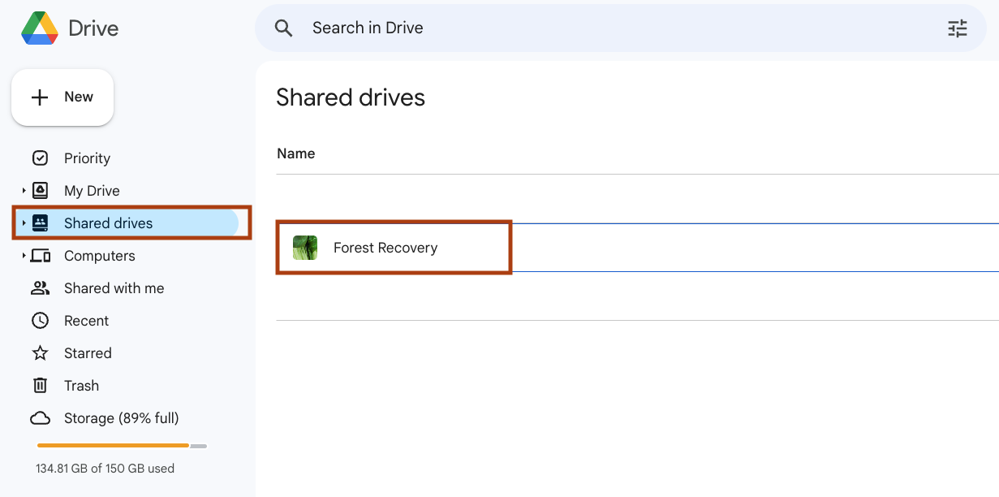

# recovery-group

GitHub repo for working group synthesizing data on post-fire forest recovery

## Google docs
- planning document: https://docs.google.com/document/d/1ERFlkZrWlxFc43DAXnr5-m4rnrp-nLO24P7ERrLxMpU/edit#heading=h.l3l802sz3npb
- meeting outlines: 
- March 20, 2023: https://docs.google.com/document/d/1AkSIKi3hAKdh-FTU22STmVHCMpZKn3OG0GFzZMMaRyU/edit
- April 18, 2023: https://docs.google.com/document/d/1AkeK6wZPPp8KwcbhHiQSgtKhUP2FjvaCrTkYWPRxe9E/edit# 

## Google drives

- Temporary drive created during the workshop: https://drive.google.com/drive/folders/1S8Ub1VvNDrFEhwQNNoxRNLwJvFVEYoCP
- Forest Recovery Shared Drive can be found in the 'Shared drives' tab in Google Drive (on your Google-enabled account):

## Other Resources
- Cyverse folder with the Sandbox data: https://de.cyverse.org/data/ds/iplant/home/shared/earthlab/Macrosystems_workshop?type=folder&resourceId=f7443e04-a3fd-11ed-a756-90e2ba675364
- Workshop GitHub repo: https://github.com/Chathu84/Macrosystems_resilience_workshop_2023.git
